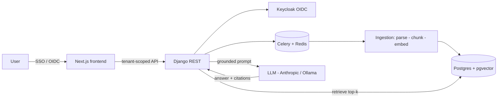

# TenantIQ

> Multi-tenant document intelligence: each tenant uploads their documents and gets an AI assistant that answers questions **grounded only in their own data**, with citations.

[](https://github.com/rbalukja15/tenantiq/actions/workflows/ci.yml)

[](#)

<!-- TODO(#28): replace with a 30s demo GIF -->
<p align="center"><em>Demo GIF coming in M8.</em></p>

## The problem

Teams sit on large private document sets (contracts, manuals, reports) and can't search them in natural language. Generic chatbots hallucinate and have no notion of *whose* data they're answering from. TenantIQ is a production-shaped answer: strict per-tenant isolation, grounded retrieval, cited answers, and a measured quality bar.

## Why it's worth a look

A production-shaped RAG system built in the open — one reviewed PR per issue, an ADR for every real decision, and a day-by-day [**dev log**](docs/devlog.md).

- **Tenant isolation is proven, not promised.** Each tenant's data is walled off by **two independent layers** — a scoped ORM manager *and* forced Postgres row-level security. An [adversarial test suite](backend/tests/test_tenant_isolation.py) shows the database still blocks a cross-tenant read *with the application filter deliberately removed*. Design: [`docs/tenant-isolation.md`](docs/tenant-isolation.md).
- **Grounding is a hard contract, by design.** The rule the M3 query engine is being built to enforce (in progress): the LLM never computes numbers and never invents citations — answers stay grounded in retrieved tenant-scoped chunks, and every citation resolves to a real chunk ID. The faithful, offset-addressable chunks it will cite already ship.
- **Engineered like a product.** Async ingestion (parse → chunk → embed) with retries and observability, and a one-command Docker stack (`make dev`) that brings up the whole system.
- **Decisions are written down.** Six [Architecture Decision Records](docs/adr) explain the *why* behind the stack, isolation model, chunking, embeddings, and deployment.

**Status:** M0–M2 complete (auth + two-layer isolation, full ingestion pipeline); M3 (RAG query engine) in progress. See the [Roadmap](#roadmap).

## Architecture



See [`docs/architecture.md`](docs/architecture.md) for the full breakdown and [`docs/adr/`](docs/adr) for the decisions behind it.

## Tech stack & why

| Layer | Choice | Why |
|------|--------|-----|
| Backend | Django REST | Mature, batteries-included, strong ORM for tenant scoping |
| Frontend | Next.js + TypeScript | App Router, streaming UI, type safety |
| Vectors | Postgres + pgvector | One datastore; isolation and vectors in the same tenant-scoped rows |
| Async | Celery + Redis | Decouple slow ingestion from requests |
| Auth | Keycloak (OIDC) | Per-tenant identity providers; tenant resolved only from the verified token |
| LLM | Anthropic API (Ollama fallback) | Quality with a local/cost option |

## Run locally

```bash
make dev      # full stack via Docker Compose: Postgres(pgvector) + Redis + Ollama + backend + Celery worker + frontend
make smoke    # push a sample doc through the running stack and wait for READY (real worker + embedder)
make test     # pytest + vitest
make lint     # ruff + black + eslint
make eval     # retrieval + faithfulness evaluation suite — lands in M5 (currently a stub)
```

`make dev` seeds `.env` from `.env.example` on first run and needs only Docker. A fresh clone comes up on Postgres with row-level security enforced — never silently on SQLite.

## Roadmap

Progress is tracked in [GitHub issues](https://github.com/rbalukja15/tenantiq/issues) and [milestones](https://github.com/rbalukja15/tenantiq/milestones):

- **M0** ✅ Project setup & documentation foundation
- **M1** ✅ Auth & multi-tenancy — two-layer tenant isolation, proven by tests
- **M2** ✅ Document ingestion pipeline — parse, chunk, embed, with retries & observability
- **M3** 🚧 RAG query engine — retrieval hardening landed; query API & citations next
- **M4** ⬜ Frontend & streaming UX
- **M5** ⬜ Evaluation harness (`make eval`)
- **M6** 🚧 Deployment & CI/CD — one-command Docker Compose stack landed
- **M7** ⬜ Observability & cost dashboard
- **M8** ⬜ Polish & recruiter-ready docs

## Key engineering decisions

- [ADR-0001 — Stack & scope](docs/adr/0001-stack-and-scope.md)
- [ADR-0002 — Tenant isolation strategy](docs/adr/0002-tenant-isolation.md)
- [ADR-0003 — Chunking strategy](docs/adr/0003-chunking-strategy.md)
- [ADR-0004 — Embeddings & vector store](docs/adr/0004-embeddings-and-vector-store.md)
- [ADR-0005 — Ingestion observability & retry model](docs/adr/0005-ingestion-observability.md)
- [ADR-0006 — Local dev containerization](docs/adr/0006-local-dev-containerization.md)

## License

MIT © Romarjo Balukja
