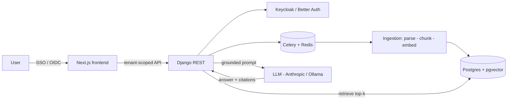

# TenantIQ

> Multi-tenant document intelligence: each tenant uploads their documents and gets an AI assistant that answers questions **grounded only in their own data**, with citations.

[](https://github.com/rbalukja15/tenantiq/actions/workflows/ci.yml)

[](#)

<!-- TODO(#28): replace with a 30s demo GIF -->
<p align="center"><em>Demo GIF coming in M8.</em></p>

## The problem

Teams sit on large private document sets (contracts, manuals, reports) and can't search them in natural language. Generic chatbots hallucinate and have no notion of *whose* data they're answering from. TenantIQ is a production-shaped answer: strict per-tenant isolation, grounded retrieval, cited answers, and a measured quality bar.

## Architecture



See [`docs/architecture.md`](docs/architecture.md) for the full breakdown and [`docs/adr/`](docs/adr) for the decisions behind it.

## Tech stack & why

| Layer | Choice | Why |
|------|--------|-----|
| Backend | Django REST | Mature, batteries-included, strong ORM for tenant scoping |
| Frontend | Next.js + TypeScript | App Router, streaming UI, type safety |
| Vectors | Postgres + pgvector | One datastore; isolation and vectors in the same tenant-scoped rows |
| Async | Celery + Redis | Decouple slow ingestion from requests |
| Auth | Keycloak / Better Auth | Per-tenant OIDC providers |
| LLM | Anthropic API (Ollama fallback) | Quality with a local/cost option |

## Run locally

```bash
make dev      # backend + frontend + Postgres(pgvector) + Redis via compose
make test     # pytest + vitest
make lint     # ruff + eslint
make eval     # retrieval + faithfulness evaluation suite
```

## Roadmap

Progress is tracked in [GitHub issues](https://github.com/rbalukja15/tenantiq/issues) and [milestones](https://github.com/rbalukja15/tenantiq/milestones):

- **M0** Project setup & documentation foundation
- **M1** Auth & multi-tenancy
- **M2** Document ingestion pipeline
- **M3** RAG query engine
- **M4** Frontend & streaming UX
- **M5** Evaluation harness
- **M6** Deployment & CI/CD
- **M7** Observability & cost dashboard
- **M8** Polish & recruiter-ready docs

## Key engineering decisions

- [ADR-0001 — Stack & scope](docs/adr/0001-stack-and-scope.md)
- [ADR-0002 — Tenant isolation strategy](docs/adr/0002-tenant-isolation.md)
- ADR-0003 — Chunking strategy *(M2)*

## License

MIT © Romarjo Balukja
