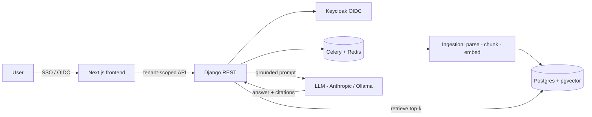

# TenantIQ

> Multi-tenant document intelligence: each tenant uploads their documents and gets an AI assistant that answers questions **grounded only in their own data**, with citations.

[](https://github.com/rbalukja15/tenantiq/actions/workflows/ci.yml)

[](#)

<!-- TODO(#28): replace with a 30s demo GIF -->
<p align="center"><em>Demo GIF coming in M8.</em></p>

## The problem

Teams sit on large private document sets (contracts, manuals, reports) and can't search them in natural language. Generic chatbots hallucinate and have no notion of _whose_ data they're answering from. TenantIQ is a production-shaped answer: strict per-tenant isolation, grounded retrieval, cited answers, and a measured quality bar.

## Why it's worth a look

A production-shaped RAG system built in the open — one reviewed PR per issue, an ADR for every real decision, and a day-by-day [**dev log**](docs/devlog.md).

- **Tenant isolation is proven, not promised.** Each tenant's data is walled off by **two independent layers** — a scoped ORM manager _and_ forced Postgres row-level security. An [adversarial test suite](backend/tests/test_tenant_isolation.py) shows the database still blocks a cross-tenant read _with the application filter deliberately removed_. Design: [`docs/tenant-isolation.md`](docs/tenant-isolation.md).
- **Grounding is a hard contract, enforced end to end.** The LLM never computes numbers and never invents citations — answers stay grounded in retrieved tenant-scoped chunks, every citation resolves to a real chunk ID, and the UI will only make a `[1]` clickable once it has fetched the passage behind it. When nothing relevant is retrieved, the product refuses and says so rather than answering thinly.
- **Engineered like a product.** Async ingestion (parse → chunk → embed) with retries and observability, a browser UI that streams an answer beside the passages it cites and manages the corpus that feeds it, and a one-command Docker stack (`make dev`) that brings up the whole system.
- **Retrieval quality is measured, not asserted.** `make eval` runs a curated question set through the real ingestion and retrieval path and reports precision@k, recall@k, hit@k and MRR, stamped with the embedder that produced them. First baselines: **hit@3 1.00, MRR 0.75** for retrieval; for grounding, **zero invented citations across 50 claims** but only **half the claims cited at all** and 18 stating a figure with nothing behind it. The harness also surfaced that the shipped similarity floor of `0.0` refuses nothing, so the product cannot decline a question it has no evidence for. Method, numbers and limitations: [`docs/evaluation.md`](docs/evaluation.md).
- **Decisions are written down.** Seventeen [Architecture Decision Records](docs/adr) explain the _why_ behind the stack, isolation model, chunking, embeddings, streaming, the frontend, and deployment.

**Status:** M0–M5 complete (auth + two-layer isolation, full ingestion pipeline, grounded RAG query engine with streamed cited answers, the frontend that uses them, and an evaluation harness that measures both retrieval and answer faithfulness); M6 (deployment) next. See the [Roadmap](#roadmap).

## Architecture


```mermaid
flowchart LR
    U[User] -->|SSO / OIDC| FE[Next.js frontend]
    FE -->|tenant-scoped API| API[Django REST]
    API --> AUTH[Keycloak OIDC]
    API --> Q[(Celery + Redis)]
    Q --> ING[Ingestion: parse - chunk - embed]
    ING --> PG[(Postgres + pgvector)]
    API -->|retrieve top-k| PG
    API -->|grounded prompt| LLM[LLM - Anthropic / Ollama]
    LLM -->|answer + citations| API
```

See [`docs/architecture.md`](docs/architecture.md) for the full breakdown and [`docs/adr/`](docs/adr) for the decisions behind it.

## Tech stack & why

| Layer    | Choice                          | Why                                                                         |
| -------- | ------------------------------- | --------------------------------------------------------------------------- |
| Backend  | Django REST                     | Mature, batteries-included, strong ORM for tenant scoping                   |
| Frontend | Next.js + TypeScript            | App Router, streaming UI, type safety                                       |
| Vectors  | Postgres + pgvector             | One datastore; isolation and vectors in the same tenant-scoped rows         |
| Async    | Celery + Redis                  | Decouple slow ingestion from requests                                       |
| Auth     | Keycloak (OIDC)                 | Per-tenant identity providers; tenant resolved only from the verified token |
| LLM      | Anthropic API (Ollama fallback) | Quality with a local/cost option                                            |

## Run locally

```bash
make dev      # full stack via Docker Compose: Postgres(pgvector) + Redis + Ollama + backend + Celery worker + frontend
make smoke    # push a sample doc through the running stack and wait for READY (real worker + embedder)
make test     # pytest + vitest
make lint     # ruff + black + eslint
make eval     # retrieval metrics against the curated dataset (seconds)
make eval-faithfulness  # also generates and judges an answer per question (minutes)
```

`make dev` seeds `.env` from `.env.example` on first run and needs only Docker. A fresh clone comes up on Postgres with row-level security enforced — never silently on SQLite.

## Roadmap

Progress is tracked in [GitHub issues](https://github.com/rbalukja15/tenantiq/issues) and [milestones](https://github.com/rbalukja15/tenantiq/milestones):

- **M0** ✅ Project setup & documentation foundation
- **M1** ✅ Auth & multi-tenancy — two-layer tenant isolation, proven by tests
- **M2** ✅ Document ingestion pipeline — parse, chunk, embed, with retries & observability
- **M3** ✅ RAG query engine — retrieval hardening, grounded generation, SSE streaming, guardrails, per-tenant limits & cost accounting
- **M4** ✅ Frontend & streaming UX — app shell + OIDC via a BFF, design system, the streaming ask screen with clickable citations, and document management (upload with progress, live ingestion status, delete)
- **M5** ✅ Evaluation harness — retrieval metrics and answer faithfulness, both measured against the real pipeline (`make eval`, `make eval-faithfulness`)
- **M6** 🚧 Deployment & CI/CD — one-command Docker Compose stack landed
- **M7** ⬜ Observability & cost dashboard
- **M8** ⬜ Polish & recruiter-ready docs

## Key engineering decisions

- [ADR-0001 — Stack & scope](docs/adr/0001-stack-and-scope.md)
- [ADR-0002 — Tenant isolation strategy](docs/adr/0002-tenant-isolation.md)
- [ADR-0003 — Chunking strategy](docs/adr/0003-chunking-strategy.md)
- [ADR-0004 — Embeddings & vector store](docs/adr/0004-embeddings-and-vector-store.md)
- [ADR-0005 — Ingestion observability & retry model](docs/adr/0005-ingestion-observability.md)
- [ADR-0006 — Local dev containerization](docs/adr/0006-local-dev-containerization.md)
- [ADR-0007 — Grounded prompt assembly](docs/adr/0007-grounded-prompt-assembly.md)
- [ADR-0008 — Grounded generation & the citation contract](docs/adr/0008-grounded-generation.md)
- [ADR-0009 — Query streaming](docs/adr/0009-query-streaming.md)
- [ADR-0010 — PII redaction & injection guardrails](docs/adr/0010-pii-redaction-and-injection-guardrails.md)
- [ADR-0011 — Per-tenant rate limiting & quotas](docs/adr/0011-per-tenant-rate-limiting-and-quotas.md)
- [ADR-0012 — Per-tenant cost & token accounting](docs/adr/0012-per-tenant-cost-and-token-accounting.md)
- [ADR-0013 — Frontend foundations (the BFF)](docs/adr/0013-frontend-foundations.md)
- [ADR-0014 — Frontend design system](docs/adr/0014-frontend-design-system.md)
- [ADR-0015 — Document deletion & citation resolution](docs/adr/0015-document-deletion-and-citation-resolution.md)
- [ADR-0016 — Rendering a streamed, cited answer](docs/adr/0016-rendering-a-streamed-cited-answer.md)
- [ADR-0017 — Managing a corpus from the browser](docs/adr/0017-document-management-ui.md)

## License

MIT © Romarjo Balukja
