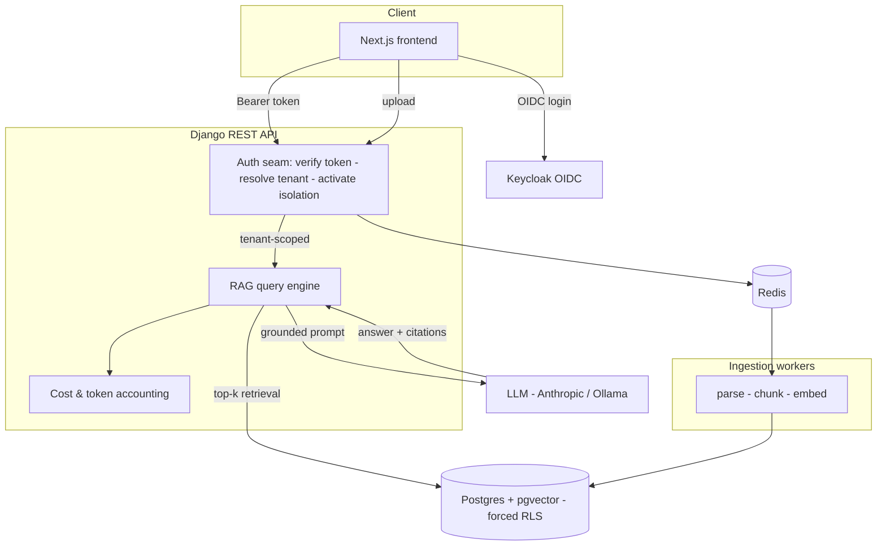

# Architecture

TenantIQ is a multi-tenant Retrieval-Augmented Generation (RAG) application. Every request
is scoped to a single tenant, and the AI only ever answers from that tenant's documents.

## System overview

Isolation is not a single box in this diagram: the auth seam *activates* the tenant, and two
independent layers — a tenant-scoped ORM manager and forced Postgres row-level security — each
enforce it (see below).

## Components

- **Frontend (Next.js).** Auth via OIDC, streaming chat with citation rendering, document
  management. Talks only to tenant-scoped API endpoints.
- **Auth seam + tenant isolation.** The DRF authenticator verifies the OIDC bearer token and
  resolves the tenant **only** from a verified token claim (never from a header, query param, or
  body), then activates that tenant for the request. Isolation is enforced by **two independent
  layers**, not a single choke point: **Layer 1** — a tenant-scoped ORM manager that filters every
  query and *raises* if no tenant is in context; **Layer 2** — forced Postgres row-level security
  that still blocks another tenant's rows even if the ORM is bypassed (raw SQL, a manager mistake).
  Proven adversarially by the #9 suite. See [`tenant-isolation.md`](tenant-isolation.md) and
  [ADR-0002](adr/0002-tenant-isolation.md).
- **Ingestion workers (Celery).** Parse uploaded documents, split into chunks per the
  chunking strategy (ADR-0003), generate embeddings, and store vectors in pgvector.
- **RAG query engine.** Embeds the question, retrieves top-k tenant-scoped chunks, builds a
  grounded prompt, calls the LLM, and enforces a structured answer-with-citations schema.
- **Postgres + pgvector.** Relational data and vectors in the same tenant-scoped rows.
- **Cost & token accounting.** Records tokens and estimated cost per request, per tenant.

## Key invariants

1. No code path returns data outside the caller's tenant. (Tested — M1.)
2. The LLM never computes numbers and never fabricates citations. (Enforced in M3 — in progress.)
3. Retrieval quality and answer faithfulness are measured, not assumed. (M5.)
