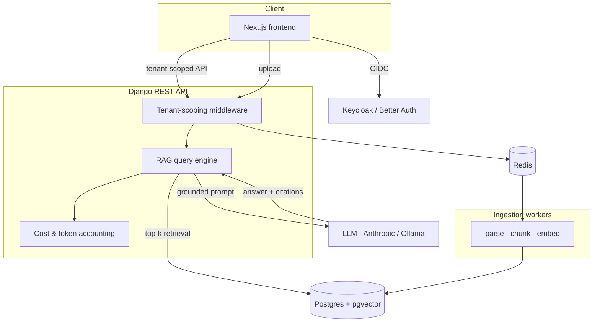

# Architecture

TenantIQ is a multi-tenant Retrieval-Augmented Generation (RAG) application. Every request
is scoped to a single tenant, and the AI only ever answers from that tenant's documents.

## System overview

## Components

- **Frontend (Next.js).** Auth via OIDC, streaming chat with citation rendering, document
  management. Talks only to tenant-scoped API endpoints.
- **Tenant-scoping middleware.** Resolves the tenant from the authenticated principal and
  forces every query to be tenant-filtered. The single enforcement point for isolation.
- **Ingestion workers (Celery).** Parse uploaded documents, split into chunks per the
  chunking strategy (ADR-0003), generate embeddings, and store vectors in pgvector.
- **RAG query engine.** Embeds the question, retrieves top-k tenant-scoped chunks, builds a
  grounded prompt, calls the LLM, and enforces a structured answer-with-citations schema.
- **Postgres + pgvector.** Relational data and vectors in the same tenant-scoped rows.
- **Cost & token accounting.** Records tokens and estimated cost per request, per tenant.

## Key invariants

1. No code path returns data outside the caller's tenant. (Tested — M1.)
2. The LLM never computes numbers and never fabricates citations. (Enforced — M3.)
3. Retrieval quality and answer faithfulness are measured, not assumed. (M5.)
